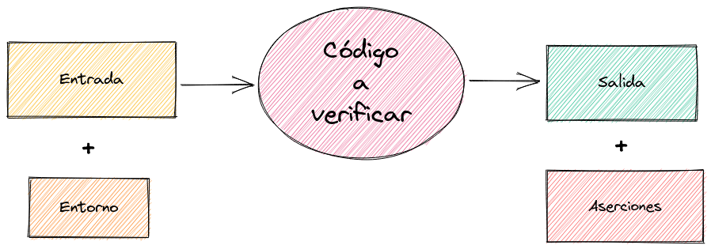
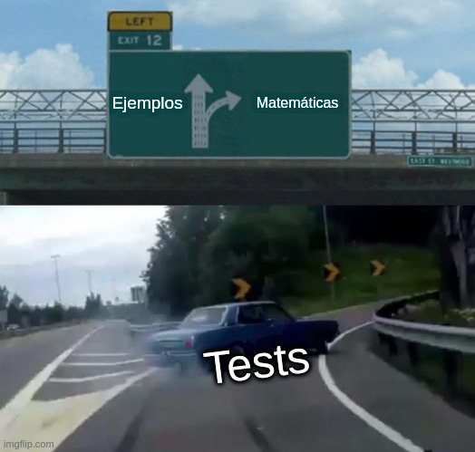
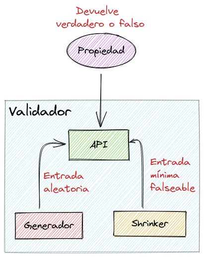
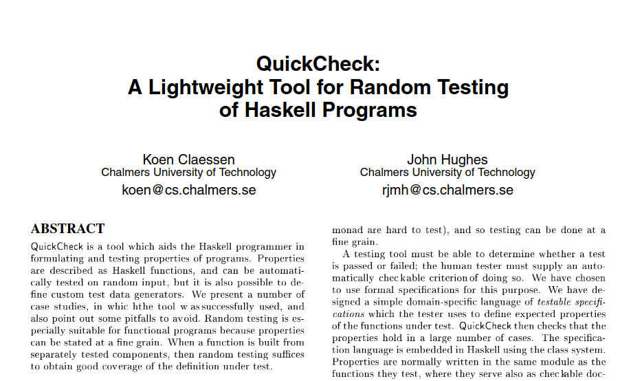
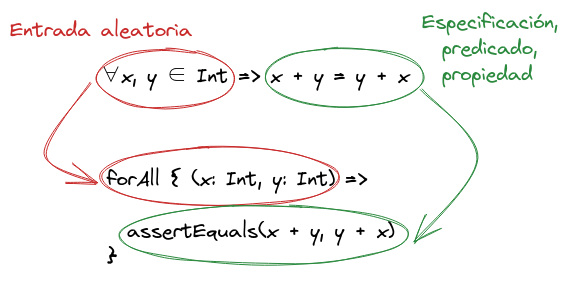

# Testing basado en propiedades


## Quién soy

**Roberto Serrano**

Desarrollo backend en Scala

Trabajo en remoto para [47 degrees](https://www.47deg.com/)

<p>
  <strong>bilki</strong> @
  <a href="https://twitter.com/bilki"><i class="fa-brands fa-twitter-square"></i></a>
  <a href="https://github.com/bilki"><i class="fa-brands fa-github-square"></i></a>
</p>


### ¿Por qué escribimos tests?

Verificación <i class="fa-solid fa-magnifying-glass"></i>
<!-- .element: class="fragment" data-fragment-index="1" -->

Documentación <i class="fa-solid fa-book"></i>
<!-- .element: class="fragment" data-fragment-index="2" -->

Note:
1. Preguntar a la audiencia por sus razones, ¿añadirían alguna más?
2. La verificación es comprobar que efectivamente el software hace lo que queremos que haga (ojo, también importa cómo lo haga)
3. La documentación es un subproducto de la especificación de las verificaciones (los requisitos)
4. El código es el *cómo*, los tests el *qué*


### Tipos de tests

* Unitarios
* Integración
* E2E
* Smoke
* Aceptación
* Golden
* UI
* Performance
* Chaos
* ...


Note:
1. Con cada tipo buscamos cubrir una necesidad distinta de verificación
2. Habitualmente, se habla de una pirámide de testing, con los unitarios en la base, etc. No entraremos en esa discusión, porque hay diversidad de opiniones al respecto


### ¿Qué es un test?



Note:
1. La entrada se entiende dentro de un contexto (entorno)
2. Las aserciones se comprueban sobre la salida
2. ¿Qué es lo más importante de un test? Aparentemente, deberían ser las aserciones sobre la salida, ¿no?


### Estructura de un test

(Casi) todos los componentes de la definición

```scala mdoc:invisible
import munit.FunSuite

def factorial(n: Int): Int =
  if (n <= 1) 1 else n * factorial(n - 1)
```

```scala mdoc
class FactorialSuite extends FunSuite {
  test("Factorial zero base case") {
    val input     = 0                 // Entrada
    val expected  = 1                 // Resultado esperado
    val result    = factorial(input)  // Salida
    assertEquals(result, expected)    // Aserción
  }
}
```

Note:
1. El entorno en este caso es vacío, no dependemos de nada externo a la entrada como pudiera ser una bbdd, la red o un reloj
2. Un test basado en propiedades no tendrá una estructura básica muy distinta a esta


### Entrada

Consideremos la entrada a una función

| Tipo      |                                         | Habitantes                  |
|-----------|-----------------------------------------|-----------------------------|
|`Boolean`  | <i class="fa-solid fa-arrow-right"></i> | `True \| False`             |
| `Int`     | <i class="fa-solid fa-arrow-right"></i> | `[-2147483648, 2147483647]` |
| `String`  | <i class="fa-solid fa-arrow-right"></i> | `???`                       |
<!-- .element: class="fragment" data-fragment-index="1" -->

Note:
1. La unidad mínima verificable es la función
2. ¿Alguien puede decirme el número de habitantes del tipo String?
3. Si la función tiene varios argumentos, multiplicamos el número de habitantes de todos sus tipos (producto cartesiano)
4. Por no hablar de otros tipos mucho más complejos, e incluso objetos mutables


### Entrada

<i class="fa-solid fa-clipboard-question"></i> \
¿Tests necesarios para una cobertura completa?
<!-- .element: class="fragment" data-fragment-index="1" -->

<i class="fa-solid fa-arrow-down-long"></i> \
Tantos como habitantes en el tipo de entrada
<!-- .element: class="fragment" data-fragment-index="2" -->

Note:
1. La cobertura de código es determinada por el número y calidad de ejemplos que proveamos
2. Inabarcable utilizar todos los posibles valores para la entrada -> ejecutar el programa para todos ellos
3. Valores significativos/interesantes


### Aserción

Ejecutamos el código a verificar

¿Se cumple el predicado?

```scala mdoc
def sum(x: Int, y: Int): Int = x + y

//          >---------vv-<
val zero  = sum(0, 0) == 0
val two   = sum(1, 1) == 2
```
<!-- .element: class="fragment" data-fragment-index="1" -->

Note:
1. Ejecutar la función con la entrada
2. La aserción tiene la forma de un predicado, una igualdad, donde un lado es la salida real, y el otro lado es la salida esperada
3. El valor resultante de la aserción es verdadero o falso: cuando es falso significa que el código es incorrecto


### Tests basados en ejemplos

Muy directos <i class="fa-solid fa-thumbs-up"></i>

Entrada y salida manuales <i class="fa-solid fa-thumbs-down"></i>

```scala mdoc:reset
def factorial(n: Int): Int =
  if (n <= 1) 1 else n * factorial(n - 1)

val f0 = factorial(0) == 1
val f1 = factorial(1) == 1
val f4 = factorial(4) == 24
```
<!-- .element: class="fragment" data-fragment-index="1" -->

Note:
1. Se adecúa muy bien al razonamiento humano, biológicamente estamos programados para aprender mediante ejemplos
2. Dicha habilidad incluye la capacidad para reconocer patrones, a partir de dichos ejemplos (lo veremos más adelante)
3. El número de ejemplos puede dispararse rápidamente, ¡no hay forma de escribirlos todos!


### Problema con los ejemplos

<i class="fa-solid fa-clipboard-question"></i> \
¿Cuántos tests son suficientes?

Note:
1. ¿A ojo? ¿Alguna heurística?
2. Recordad que la cobertura completa requiere de la simulación completa de tantos ejemplos como habitantes en los tipos de entrada


### ¿Qué dice TDD de esto?

> Write production code only to make a failing unit test pass.

<i class="fa-solid fa-list-check"></i> Pero, ¿cuáles?
<!-- .element: class="fragment" data-fragment-index="1" -->

Note:
1. La realidad es que las tres reglas (según Uncle Bob) para el TDD no dicen nada sobre esto
2. Todos los tests unitarios se ejecutan con entradas específicas, ¿qué nos impide implementar nuestro software por casos?
3. ¿Y si se nos escapa algún test?


### Más allá de TDD

* Cobertura insuficiente
* Implementación dirigida por ejemplos
* Incertidumbre

Note:
1. Debido al limitado número de ejemplos y valores a la entrada
2. Hemos visto que ejemplos específicos dan lugar a implementaciones específicas, hay que aplicar heurísticas (¿programación como arte?)
3. La incertidumbre de si hemos acertado con los ejemplos y valores


### Wait a minute...


¿Y si hubiera alguna otra forma de **probar**?

Note:
1. Vamos a dar un paso atrás
2. ¿Y si hubiera alguna forma de escribir tests que no implique listar los ejemplos significativos uno a uno?


### ¿Matemáticas?



Note:
1. Me suena que en matemáticas había alguna forma de **probar para todos los elementos** de un conjunto, ¿a vosotros no?


### Propiedad matemática

> Una propiedad `p` para todos los elementos de un conjunto `X` normalmente se define como \
`p: X -> {true, false}`

> O bien como el subconjunto de `X` para cuyos elementos la propiedad evalúa a verdadero \
`{x | p(x) = true}`
<!-- .element: class="fragment" data-fragment-index="1" -->

Note:
1. Vaya, pues sí parece que existe algo que nos permite definir un comportamiento
2. Parece que este camino nos puede llevar a poder **probar** comportamientos en nuestro software


### Propiedad matemática

Conmutatividad

> **`x * y = y * x`** \
∀ x, y ∈ `S`

Note:
1. Conmutatividad para una operación definida `*` y elementos pertenecientes a un conjunto `S`


### Propiedades en computación

¿Cómo evitar los ejemplos?

Entrada manual <i class="fa-solid fa-chevron-right"></i> **aleatoria**
<!-- .element: class="fragment" data-fragment-index="1" -->

Salida manual <i class="fa-solid fa-chevron-right"></i> **propiedades**
<!-- .element: class="fragment" data-fragment-index="2" -->

Note:
1. Uno de los problemas que vimos fue la implementación acoplada a las entradas de los tests
2. Vamos a eliminar ese problema de raíz: la entrada va a ser aleatoria
3. Vamos a pasar de dar ejemplos a definir de forma precisa la especificación (¡requisitos!)
4. No habrá más aserciones sobre valores fijos de salida


### Validador de propiedades



Note:
1. Vamos a necesitar soporte de software para poder escribir propiedades cómodamente
2. Este soporte se ofrece en forma de frameworks o librerías de testing denominadas validadores de propiedades


### Primer validador

QuickCheck - ICFP 2000



Note:
1. Es relativamente reciente, algo curioso en computación, ya que suele reutilizarse teoría de los 60/70/80
2. Originalmente escrito en Haskell, ha sido portado a otros lenguajes con más o menos éxito


### Estructura de una propiedad



Note:
1. Es casi una traducción uno a uno de la propiedad matemática, ¿no?
2. ¿Dónde está el truco, qué significa ese `forAll`?


### Generadores por defecto

```scala mdoc:invisible
import org.scalacheck.Gen
import org.scalacheck.Arbitrary._
```

```scala mdoc
val number = Gen.posNum[Int].sample.get

val string = Gen.stringOfN(10, Gen.alphaChar).sample.get

val boolean = arbitrary[Boolean].sample.get

val numbers = Gen.listOfN(5, Gen.posNum[Int]).sample.get
```

Note:
1. Generadores más habituales
2. Estos generadores dan valores aleatorios en todo el rango posible del tipo (habitantes)
3. El verificador de propiedades intentará dar más peso a los valores más problemáticos
4. Habitualmente estos valores son los casos límite típicos: 0, -1, máximo entero, mínimo, cadena vacía, lista vacía...


### Generadores personalizados

```scala mdoc
case class Person(name: String, age: Int)

val personGen = for {
  name <- Gen.stringOfN(10, Gen.alphaChar)
  age  <- Gen.chooseNum(1, 125)
} yield Person(name, age)

val person = personGen.sample.get
```

Note:
1. Muy sencillo combinar generadores por defecto para generar valores compuestos más complejos
2. Generadores más complejos = posibilidad de probar automáticamente lógica con entradas más complejas


### Encogiendo

¿Qué entrada mínima produce un fallo?


### Shrinker

Genera valores cada vez más pequeños

```scala mdoc
def adultsFrom(persons: List[Person]): List[Person] =
  persons.filter(_.age > 16) // debería ser > 17
```
<!-- .element: class="fragment" data-fragment-index="1" -->

Mínima entrada posible errónea
<!-- .element: class="fragment" data-fragment-index="2" -->
```scala mdoc
val adults = adultsFrom(List(Person("Pepe", 17))) // vacío?
```
<!-- .element: class="fragment" data-fragment-index="2" -->

Note:
1. Especialmente útil cuando por ejemplo la entrada es una cadena, o una lista de elementos
2. El shrinker va a tratar de buscar la entrada mínima que produce el fallo
3. En este ejemplo vemos que _no_ es vacío, por tanto la propiedad fallaría (ver código de ejemplo)


### Semillas

Si la entrada es aleatoria...

¿Cómo repetimos el test en el futuro?
<!-- .element: class="fragment" data-fragment-index="1" -->

```text
You can reproduce this failure by adding the following override
  to your suite:

  override val scalaCheckInitialSeed =
    "89puZ9LMPcObM1_qSIt9tRxapPu-hWG5R4XcwVwH7BH="
```
<!-- .element: class="fragment" data-fragment-index="2" -->

Note:
1. Repetimos el test hasta que la implementación lo pase
2. Una vez que pasa el test, borramos la semilla y comprobamos que la propiedad pasa para otras entradas aleatorias


### Estrategias


### Fuentes

| Título    |   Autor                                 |
|-----------|-----------------------------------------|
| [User Guide](https://github.com/typelevel/scalacheck/blob/main/doc/UserGuide.md) | Scalacheck |
| [QuickCheck: A Lightweight Tool for Random Testing of Haskell Programs](https://dl.acm.org/doi/pdf/10.1145/351240.351266) | Koen Claessen, John Hughes |
| [The lazy programmer's guide to writing thousands of tests](https://www.youtube.com/watch?v=IYzDFHx6QPY) | Scott Wlaschin |
| [Property-Based Testing: Let Your Testing Library Work for You](https://www.youtube.com/watch?v=pO4_3kg1wMw) | Magda Stożek |


### Fuentes

| Título    |   Autor                                 |
|-----------|-----------------------------------------|
| [Property (mathematics)](https://en.wikipedia.org/wiki/Property_(mathematics)) | Wikipedia |
| [Refactoring the three laws of TDD](http://www.javiersaldana.com/articles/tech/refactoring-the-three-laws-of-tdd) | Javier Saldana |